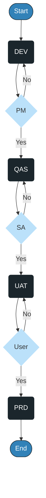
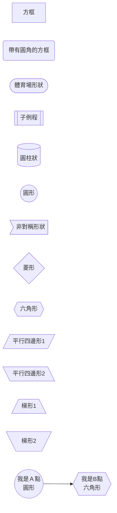
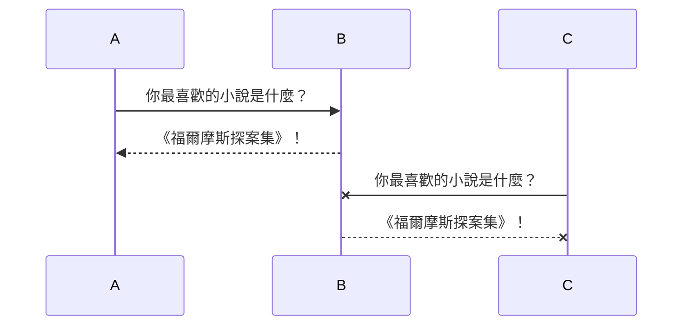
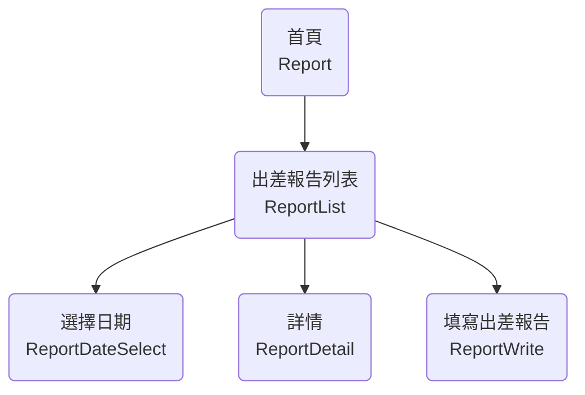
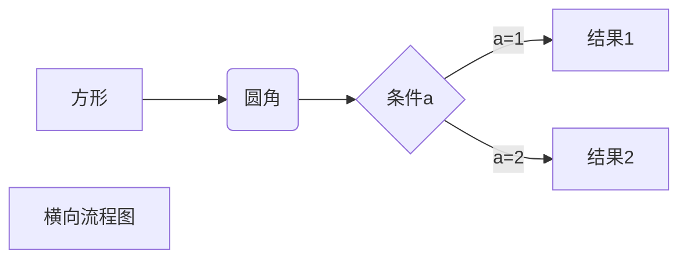

## 圖表

安裝插件flowchart 或mermaid。

## flowchart
1. 節點  
開始節點-默認文字為: **start**  
結束節點-默認文字為: **end**

:::tip 範例：
使用插件**flowchart** 而製作的流程圖。

@flowstart
st=>start: 開始值
e=>end: 結束值

st->e
@flowend


程式碼：
```md{1,8}
@flowstart
// 必須先定義名稱
st=>start: 開始值
e=>end: 結束值

//流程方向
st->e
@flowend
```
:::


@flowstart
process=>operation: Operation
e=>end: End

process->e
@flowend


@flowstart
cond=>condition: Process?|past:>https://www.google.com
process=>operation: Process
e=>end: End|future:>https://www.google.com

cond(yes)->process->e
cond(no)->e
@flowend










A first level header
====================

A second level header
---------------------

